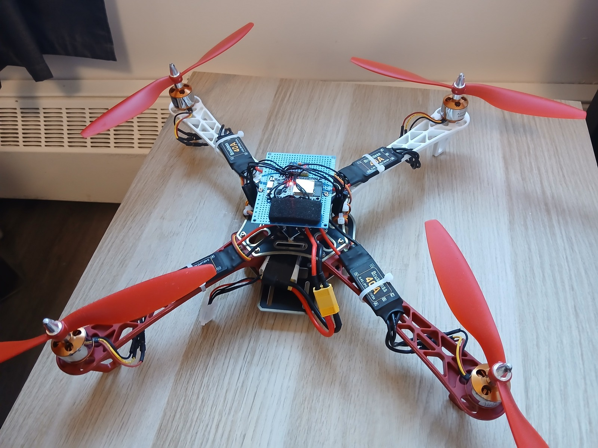
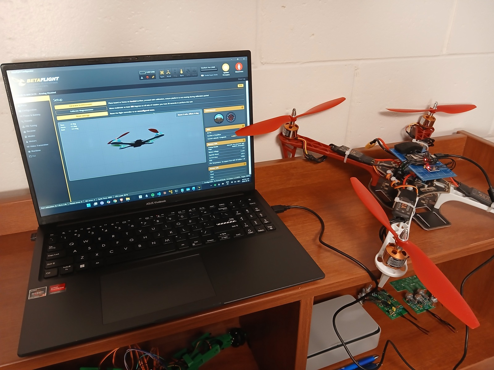
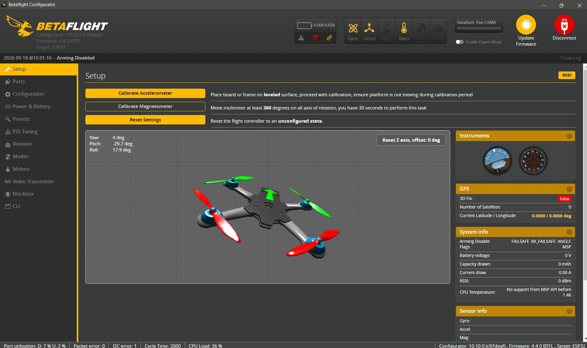

# Build photos

Assembled F450 quadcopter with its central electronics and four ESCs.

Quadcopter beside the configuration interface.

Setup tab with a tilted 3D quadcopter model and calibration controls. The aircraft runs esp-fc.
